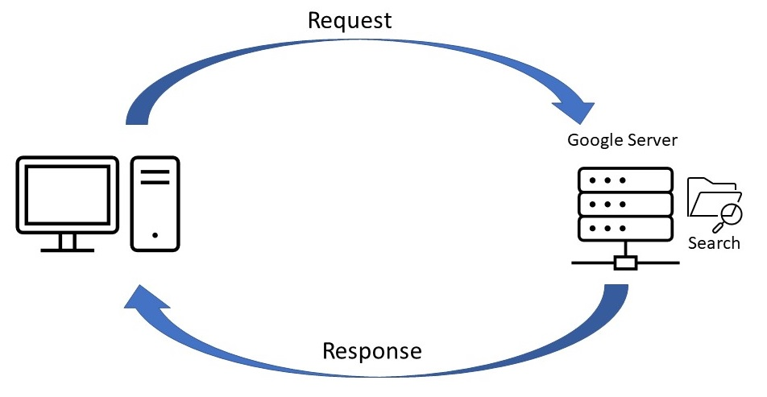

# API and Web Service

## API

API - Application Programming Interface

| Letter | Word | Meaning |
| :--- | :--- | :--- |
| A | Application | Software that does a task |
| P | Programming | Program \(P\) that does the task in the Application \(A\) |
| I | Interface | Place \(I\) to tell the program \(P\) to run |

**API Definition:** You tell \(I\) a program \(P\) to run in an application \(A\)

| Level od Difficulty | Example | I \(Interface\) | P \(Program\) | A \(Application\) |
| :--- | :--- | :--- | :--- | :--- |
| Simple | Messenger message using smartphone | smartphone | message | Messenger |
| Simple | Google search using computer | computer | search | Google |
| **Moderate/Complex** | **Create orders in Amazon \(in system\)** | **Amazon** | **create orders** | **Amazon** |

### How API works

1. Request
2. Program
3. Response

1. We type any search to www.google.com like "wikipedia"
2. Press Enter &gt; Request is send to google Server
3. A program "/search" is run
4. Send by response our results of searching

www.google.com/search?q=wikipedia

/search            -&gt; folder on www.google.com server  
?q=wikipedia  -&gt; our search parameter 

## Web Service

Web               -&gt; internet  
Service          -&gt; API  
Web Service -&gt; API that uses the internet

| **Web Service** | **API** |
| :--- | :--- |
| All web services are APIs. | All APIs are not web services. |
| It supports XML. | Responses are formatted using Web API's MediaTypeFormatter into XML, JSON, or any other given format. |
| You need a SOAP protocol to send or receive and data over the network. Therefore it does not have light-weight architecture. | API has a light-weight architecture. |
| It can be used by any client who understands XML. | It can be used by a client who understands JSON or XML. |
| Web service uses three styles: REST, SOAP, and XML-RPC for communication. | API can be used for any style of communication. |
| It provides supports only for the HTTP protocol. | It provides support for the HTTP/s protocol: URL Request/Response Headers, etc. |

_the difference i just copy from_ 



## HTTP

HTTP - Hypertext Transfer Protocol  
**`http(s)`**`://www.google.com`

### Parts of HTTP

<table>
  <thead>
    <tr>
      <th style="text-align:left">HTTP</th>
      <th style="text-align:left">Request</th>
      <th style="text-align:left">Response</th>
    </tr>
  </thead>
  <tbody>
    <tr>
      <td style="text-align:left"><b>Start line</b>
      </td>
      <td style="text-align:left">Version HTTP/1.1, Method (GET/POST...),API program location, parameters...</td>
      <td
      style="text-align:left">Version HTTP/1.1, Status Code (200 OK)</td>
    </tr>
    <tr>
      <td style="text-align:left"><b>HEADERS</b>
      </td>
      <td style="text-align:left">
        <ul>
          <li>Host: www.google.com</li>
          <li>Token: xxxxxx (API token)</li>
        </ul>
      </td>
      <td style="text-align:left">
        <ul>
          <li>Cookie: xxx</li>
          <li>Cookie: xyz...</li>
          <li>HTML</li>
        </ul>
      </td>
    </tr>
    <tr>
      <td style="text-align:left"><b>Blank line</b>
      </td>
      <td style="text-align:left"><em>(just separator of HEAD and BODY)</em>
      </td>
      <td style="text-align:left"><em>(just separator of HEAD and BODY)</em>
      </td>
    </tr>
    <tr>
      <td style="text-align:left"><b>BODY</b>
      </td>
      <td style="text-align:left">When use POST by registration
          <b>Username </b>and <b>Password</b>
      </td>
      <td style="text-align:left">HTML</td>
    </tr>
  </tbody>
</table>

#### Start line

|   | Request | Response |
| :--- | :--- | :--- |
| Name | Start line, Request line | Start line, Response line |
| HTTP Version | HTTP/1.1 | HTTP/1.1 |
| Method | GET, POST, PUT, DELETE, ... | No |
| API Program Folder Location | Yes \(example: /search\) | No |
| Parameters | Yes \(example: ?q=wikipedia\) | No |
| Status Code | No | Yes \(example: 200 OK\) |
| Format | Method \(space\) API Program Folder  Location+Parameters \(space\) HTTP Version | HTTP Version + Status Code |
| Example | GET ~~_/search?q=wikipedia_~~_\(optional\)_ HTTP/1.1 | HTTP/1.1 200 OK |

#### Headers



#### Blank line

There is where head end and body beginning.

#### Body



### HTTP Methods

The most popular are GET, POST, PUT, DELETE like in database CRUD \(Create, Read, Update, Delete\)

| HTTP methods | Description |
| :--- | :--- |
| **GET** | Read \(get data from server\) |
| **POST** | Create \(post data into server\) |
| **PUT** | Update \(put file into server\) |
| **DELETE** | Delete \(delete the object at the location\)  |
| HEAD |  |
| TRACE |  |
| OPTIONS |  |
| CONNECT |  |
| PATCH |  |

### HTTP Status Codes

The groups of HTTP status codes:

#### 1xx Informational response

#### 2xx Success

200 OK  
201 Created

#### 3xx Redirection

#### 4xx Client errors

400 Bad Request  
404 Not Found

#### 5xx Server errors

500 Internal Server Error  
502 Bad Gateway



## 

## JSON


Nowadays is more populary than XML


JSON -&gt; **J**ava**S**cripts **O**bject **N**otation

HTTP Header Line: Content-Type: application/json  
HTTP Body: JSON  
JSON uses "Key" : "Value" \(e.g. "Fruit" : "Apple"\)

To show how JSON works i used online editor:




Mozilla Firefox could open .JSON file without any extension


## XML

XML -&gt; e**X**tensible **M**arkup **L**anguage

HTTP Header Line: Content-Type: application/xml  
HTTP Body: XML  
XML uses tags &lt;&gt; \(e.g. &lt;button&gt;Click Me!&lt;/button&gt;\)

## REST


Nowadays is more populary than SOAP


REST -&gt; **Re**presentational **S**tate **T**ransfer

REST is used to complete a Web Service \(API\) using HTTP  

**4 HTTP Request Parts  
Start line** All Methods \(GET, POST, PUT, DELETE, ...\)  
**Header Line** All  
**Blank Line  
Body** Any \(JSON, XML, html, images, ...\)

## SOAP

SOAP -&gt; **S**imple **O**bject **A**ccess **P**rotocol

SOAP uses a WSDL \(Web Service Description Language\)

**4 HTTP Request Parts  
Start line** POST WSDL HTTP Version  
**Header Line** Content-Type: text/xml  
**Blank Line  
Body** XML envelope formed using WSDL

## Browser DevTools

GoogleChrome **F12**  
MozillaFirefox **F12**  
Opera **Ctrl+Shift+C**

