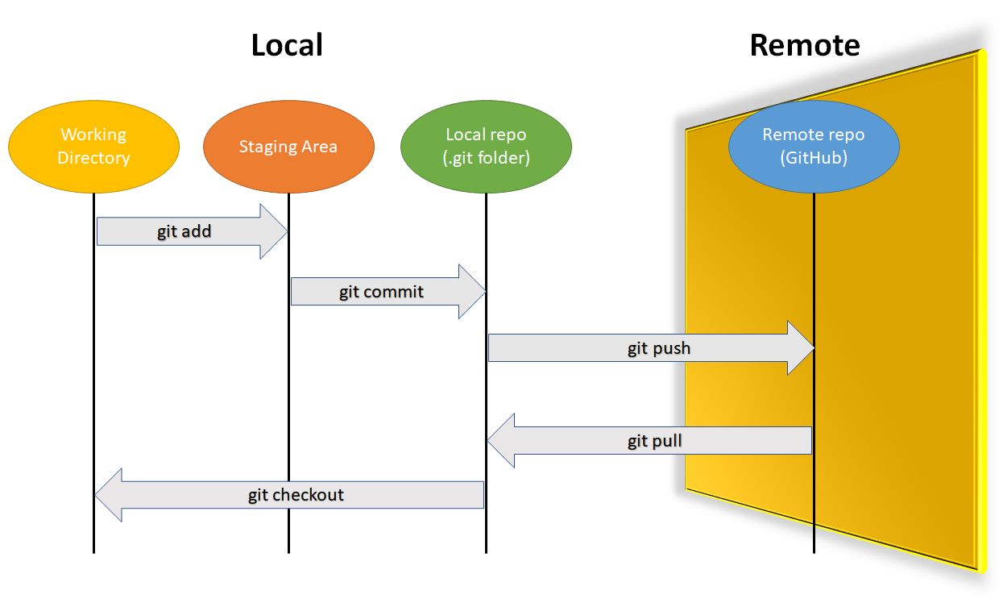
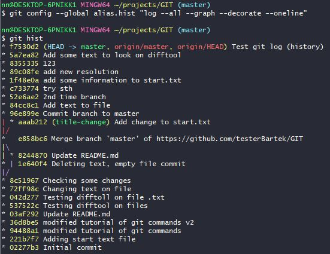
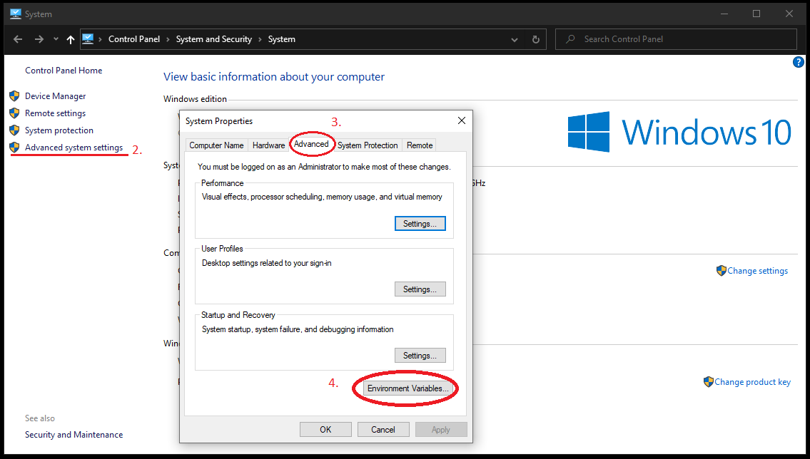

# Git

#### Main documentations on website  [https://git-scm.com/docs](https://git-scm.com/docs)



## Quick start

### Clone, add, commit and push \(GitHub\)

```bash
$ cd projects #your path
$ pwd
# 1. Clone project from GitHub
$ git clone https://github.com/testerBartek/GIT
$ cd GIT
$ git status
# 2. Create test.txt with wrote Test Git
$ echo "Test Git" >> test.txt
$ ls
$ cat test.txt
$ git status
# 3. Add, Commit with message
$ git add test.txt
$ git status
$ git commit -m "Add a test.txt file"
$ git status
# 4. Push to remote Repo (GitHub)
$ git push origin master
```

### Init \(Fresh Project\), use alias notepad++, remove

```bash
$ cd projects
$ ls
# 1. init Fresh Project
$ git init gitFromLocalRepo
$ ls
$ cd gitFromLocalRepo
# 2. Looking on hidden folder .git
$ ls -al
$ cd .git/
$ ls
$ git status
# 3. Create a new .txt file using alias with notepad++ (npp)
$ npp testLocalRepo.txt #notepad++ should be openned, and write sth, save, and exit
$ ls #.txt file is created
$ git status #untracked file testLocalRepo
$ git add testLocalRepo.txt
$ git status # changes to be comitted
$ git commit -m "Create a new Remote Repo from Local Repo"
$ git status #nothing to commit, working tree clean
$ cd ..
$ ls
# 4. Force remove whole folder testLocalRepo
$ rm -rf testLocalRepo
$ ls #repo is removed.
```

### Unzip and mv of dir, remote GitHub

```bash
#by using website http://www.initializr.com/ download a data to a new repository
#download it :)
$ cd projects
# 1. unzip directory
$ unzip ~/Downloads/initializr-verekia-4.0.zip #folder unzipped in our path
$ ls #name of directory is initializr
# 2. change name of directory
$ mv initializr repoExistingProject #mv CURRENT_NAME_OF_DIR FUTURE_NAME_OF_DIR
$ ls #check name - now is repoExistingProject
$ cd repoExistingProject
$ ls 
# 3. init empty Git repo of existing project
$ git init #Initialized empty Git repository in 
#C:/Users/nn/projects/repoExistingProject/.git/
$ git status #a lot of untracked files
$ git add . #Adding whole untracked files to Staging Area
$ git status #All files are added as new file.
$ git commit -m "Creating first git repo from Existing project"
$ git status #On branch master \n nothing to commit, working tree clean
# 4. Push existing repo to remote repo (GitHub)
# Firstly we need to create new repository on our github: 
$ git remote add origin https://github.com/testerBartek/repoExistingProject
$ git remote -v #check is it corectly added
#origin  https://github.com/testerBartek/repoExistingProject (fetch)
#origin  https://github.com/testerBartek/repoExistingProject (push)
$ git push origin master
```

## The basic commands

```bash
$ mkdir NAME_OF_DIRECTORY
#Making a new folder from git bash.
$ mkdir -p folder1/folder2/folder3
#Making a new folders in given path folder1/folder2/folder3
```

```bash
$ cd NAME_OF_DIRECTORY
$ cd ..
#Changing current directory
```

```bash
$ pwd
#Checking current path.
```

```bash
$ ls
$ ls -al #show files in hidden directory .git
#list all folders and files in our current path.
```

```bash
$ echo "Test Git" >> test.txt
#Create a notepad file "test.txt" where is wrote Test Git.
$ cat test.txt
#Show in git bash what is wrote in this file.
```

```bash
$ clear 
#clear console
$ exit
#exit console
```

## Setup and Config

### git

```bash
$ git version
#checking installed version of git

$ git update-git-for-windows
#download and update the newest version of git
```

### git config

```bash
$ git config --global user.name "Bartek Szeląg"
$ git config --global user.email "tester.bszelag@gmail.com"
#adding user with name and email address to global in git.

$ git config --global --list
#show list of global data

$ npp ~/.gitconfig
$ notepad++ ~/.gitconfig
#edit .gitconfig file with notepad++
```

## Getting and Creating Projects

### git init

```bash
$ git init gitFromLocalRepo #name of new repo
#initialized empty Git repository in C:/Users/nn/projects/gitFromLocalRepo/.git/
#in current path was created a new folder with hide files name .git
```

### git clone

```bash
$ git clone https://github.com/testerBartek/GIT
#full copy of our repository Github on our system.
```


Copy will be create in our current path \($ pwd\)


## Basic Snapshotting



### git add

```bash
$ git add test.txt
$ git add .
#adding untracked files to git. [To Staging Area]
$ git add -A
#if we changed the name of file without git.
#1st file is deleted and 2nd file is added.
#by using add -A the same files are changed on renamed. 
```


With dot "." adding all the untracked files.


### git status

```bash
$ git status
#Changes about git status only are visible when you add, 
#delete or modify your documents which is in .git
```


On start of learning use this command very often.


### git restore

```bash
###delete changes from workind directory###
# make any change in file
$ git status
#Changes not staged for commit:
#  (use "git add <file>..." to update what will be committed)
#  (use "git restore <file>..." to discard changes in working directory)
#        modified:   humans.txt

$ git restore humans.txt
#to check
$ git status
#nothing to commit, working tree clean

$ git restore --staged humans.txt #doing the same thing like git reset
```

### git reset

```bash
###changes from staging area > working directory###
$ git add humans.txt
$ git status
#Changes to be committed:
#  (use "git restore --staged <file>..." to unstage)
#        modified:   humans.txt

#if file is added to Staging Area

$ git reset
#Unstaged changes after reset:
#M       humans.txt

#back file to untracked to working directory

#2.
$ git rm humans.txt
$ git status
$ git reset
```

### git commit

```bash
$ git commit -m "TYPE_YOUR_MESSAGE"
#commit all changes with message in quote. [To Local Repository]
$ git commit -am "TYPE_YOUR_MESSAGE"
#adding a untracked files and after that commit

```

### git rm

```bash
$ git rm humans.txt
#Changes to be committed:
#  (use "git restore --staged <file>..." to unstage)
#       deleted:    humans.txt

$ git rm -rf NAME_OF_DIRECTORY # -f force # -f r directory name
#Force remove everything from given name of folder 
#(whole with hidden folder .git too)
```

### git mv

```bash
$ git mv css/ abc/
#Renamed folder changes paths of every files in this directory.
$ git mv humans.txt test.txt #[current_name feature_name]
#Change name of files.
```


Remember to use git mv not only mv. If we don't use it files wouldn't be renamed. They are deleted and add new one. After that use git add -A to repair it.


## Branching and Merging

### git log

```bash
$ git log #show number of commit, author, date, and message
$ git log -- test.txt #[file name] show only commites on specific file

#commit f7530d23c2cd43a84954146269bca03b56bcd20b 
#(HEAD -> master, origin/master, origin/HEAD)
#Author: Bartek <tester.bszelag@gmail.com>
#Date:   Mon Aug 10 08:35:02 2020 +0200
#    Test git log (history)
#
#commit 5a7ea8258abbd4338ec274d5f010d5117d95c9f0
#Author: Bartek <tester.bszelag@gmail.com>
#Date:   Sun Aug 9 20:44:12 2020 +0200
#    Add some text to look on difftool

$ git log --abbrev-commit 
#show the same informations but commit number shorten to 7 characters
#it's easier to use commit number to another actions of logs.

#commit f7530d2 (HEAD -> master, origin/master, origin/HEAD)
#Author: Bartek <tester.bszelag@gmail.com>
#Date:   Mon Aug 10 08:35:02 2020 +0200
#    Test git log (history)
 
 $ git log --oneline --graph
 #--oneline
 # show 7 characters of commit number (like using --abbrev-commit)
 # commit message
 # --graph
 # show way of commites
 
* 84cc8c1 Add text to file
* 96e899e Commit branch to master
*   e858bc6 Merge branch 'master' of https://github.com/testerBartek/GIT
|\ #--graph command
| * 8244870 Update README.md
* | 1e640f4 Deleting text, empty file commit
|/ #--graph command
* 8c51967 Checking some changes

$ git log --since="3 days ago"
#the same command like git log (but only show period time)

$ git show f7530d2

#commit f7530d23c2cd43a84954146269bca03b56bcd20b 
#(HEAD -> master, origin/master, origin/HEAD)
#Author: Bartek <tester.bszelag@gmail.com>
#Date:   Mon Aug 10 08:35:02 2020 +0200
#    Test git log (history)
#
#diff --git a/test.txt b/test.txt
#index 085cb08..c17c4b0 100644
#--- a/test.txt
#+++ b/test.txt
#@@ -2,4 +2,5 @@ Test Git
# 2
# 3
# 4
#+Test git log (history)
# 5

```


To quit command $ git logs use key "q"




## Sharing and Updating Projects

### git pull

Check for modifications and copy it from remote Repository.

```bash
#1. change any file on the website e.g. 
#https://github.com/testerBartek/repoExistingProject

$ git pull origin master #check to any change from github

#remote: Enumerating objects: 5, done.
#remote: Counting objects: 100% (5/5), done.
#remote: Compressing objects: 100% (3/3), done.
#remote: Total 3 (delta 1), reused 0 (delta 0), pack-reused 0
#Unpacking objects: 100% (3/3), 774 bytes | 32.00 KiB/s, done.
#From https://github.com/testerBartek/repoExistingProject
# * branch            master     -> FETCH_HEAD
#   77b3204..9dd2a4c  master     -> origin/master
#Updating 77b3204..9dd2a4c
#Fast-forward
# README.md | 2 ++
# 1 file changed, 2 insertions(+)

#If local Repo is up to date it will show

$ git pull origin master
#From https://github.com/testerBartek/repoExistingProject
# * branch            master     -> FETCH_HEAD
#Already up to date.

```

### git push

```bash
$ git push origin master
#Local changes are push to remote GitHub and on website changes are made.
#origin - GitHub copy of our repository
#master - master branch
```

### git remote

Add existing local repository to GitHub remote repository.

```bash
$ git remote add origin https://github.com/testerBartek/repoExistingProject
# Sets the new remote by remote repository URL from GitHub 
$ git remote -v # Verifies the new remote URL
#> origin  https://github.com/testerBartek/repoExistingProject (fetch)
#> origin  https://github.com/testerBartek/repoExistingProject (push)

```

## Guides

### gitignore

```bash
#1. create file .gitignore
$ npp .gitignore

#2. add files which we want ignore (no commit)
#in single line
#specific file: file.xyz
#file pattern: *.xyz
#folder: xyz_folder/

#3. add and commit .gitignore file
```


something in .gitignore file will never be commited


## Plumbing Commands

### git ls-files

```bash
$ git ls-files
#list a tracked files
```

## Git programs integrations

### Environment variable

1. Copy path of file .exe of your program
2. Open Advanced system settings
3. Advanced
4. Environment Variables
5. Find Path in system variables and Click Edit...
6. Add new path like \(C:\Program Files\Notepad++\)



### Adding alias

#### Alias to git bash

1. Path to Your user like $ pwd  /c/Users/nn
2. Use command $ notepad++ .bash\_profile

```bash
$ notepad++ .bash_profile
```

3. In new line just type an alias like You want.  
For example to open "notepad++" don't type whole name just type or "npp".

```bash
alias npp='notepad++.exe -multiInst -nosession'
```

4. Save and close notepad++. Close and open again git bash.  
5. Now after type $ npp should open notepad++

#### Alias to .git projects

1. alias to git log --all --graph --decorate --oneline"

```bash
$ git config --global alias.hist "log --all --graph --decorate --oneline"
# to use it in git bash
$ git hist
```

### Notepad++


Generally remember to close notepad++ and back to git bash.


1. Add notepad++ to environment variable
2. After that notepad++ could be run from git bash

```bash
$ notepad++
```

3. You could add alias to create shortcut to open notepad++ like in Adding alias Heading.

4. Add notepad++ to global core editor

```bash
$ git config --global core.editor "notepad++.exe -multiInst -nosession"
```

5. Check is it correct \(if open in notepad++ it is correctly\)

```bash
$ git config --global -e
```

