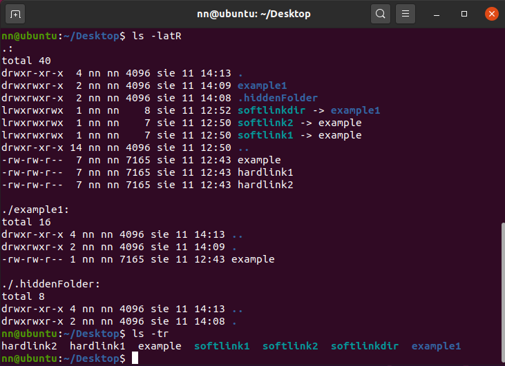

# Ubuntu

#### Main documentation: [https://help.ubuntu.com/](https://help.ubuntu.com/)

## How to install Ubuntu on VirtualBox



## First steps with terminal

```bash
#Shortcut to OPEN terminal
ctrl + alt + t

#Shortcut to CLOSE terminal
ctrl + d

#Kill the terminal proccess
cltr + c

#Auto completion of files names
use TAB while you are typing any name of file
```

## Shortcuts

```bash
ctrl + A    #move your cursor to the beginning of the line
ctrl + E    #move your cursor to the End of the line
alt + C     #convert Capital character of word on Uppercase and rest on Lowercase
alt + L     #convert all characters beggining from the cursor on Lowercase
alt + U     #convert all characters beggining from the cursor on Uppercase
ctrl + K    #Cut the text from the cursor to the end of the line (Kill text)
ctrl + U    #Cut the text from the cursor to the beggining of the line
ctrl + Y    #Paste the text that you did cut (Yanking text)
```

## Basic terminal commands

### help

help command will help us how to use a parameters

```bash
help cd
help rm

cd --help
rm --help
```


### man

* manual page of commands \(like help, but better graphical\)

```bash
man cp
```


### whatis

* short description of linux commands


### history

* show history of commands used in terminal
* the whole bash history is in file ~/.bash\_history

```bash
history #show you whole history of terminal

history 20 #limited by number like 5, 20, 100 ...

history -c #clean whole history (be careful)

!412 #if u type it in console just it use 412 command from history list
412 -> git clone https://github.com/testerBartek/GIT

#to look on file with history
gedit ~/.bash_history
```


### pwd

print working directory


### cd

change directory

```bash
cd Desktop/      #path to cd
cd ..            #previos level of directory   
cd /             #go to root dir 
cd ~             #go to home/USER dir
cd -             #back to previous dir (in memory)
```


### echo

* print a wrote text

```bash
echo texttoprint
>testtoprint
```

### gedit

* graphical text editor
* create a new file and start to edit
* edit current file 

```bash
gedit test #open a text editor
#you can close it, write something, save

#after you close editor, you can back to terminal
```

### nano

* terminal text editor

```bash
nano test #open file in terminal

#you are allow to edit it

#^G ^O ^W => ctrl+G ctrl+O ctrl+W ...
```


### cat / tac

* show text in the same window of terminal

```bash
cat test #normal text
tac test #reverse 
```


### head / tail

* head print first lines from the file
* tail print the last lines from the file


\[TIP\]     to create 30 or more lines of numbers use command:

```bash
for((i=1;i<=30;i++)); do echo $i >> 30lines; done
```


```bash
t   ail 30lines     #tail FILE_NAME
head 30lines     #head FILE_NAME
#default command print 10 lines

tail -5 30lines  #-5 it's parameter how much lines to print
head -8 30lines
tail -n 5 30lines
```


### wc

* show line number , word number , byte/character numbers 

```bash
wc test #wc FILE_NAME
 9  60 390 test
 #9 -> line number
 #60 -> word number
 #390 -> character numbers
 
 wc -l  #only show line number
 wc -w  #only show word number
 wc -c  #only show character number
 wc -L  #show the characters of the longest line!
```

### ls

* list a directory content

```bash
# Basic ls commands
ls           # list a dir
ls /         # list root dir
ls ~         # list home dir
ls ..        # list previous dir files
```


```bash
ls -i        # inode number
ls -l        # file size in bytes, date and time of modifications
```


```bash
ls -a        # show every files (.hidden too)
ls -t        # show by last modificated files
ls -r        # reverse order (normal ls from A to Z, with -r from Z to A)
ls -R        # showing every dir and everything what is inside
```


hidden files always have dot "." before name like .hidden



```bash
#every parameters we could mix
ls - ali = ls -ail = ls -ial = ls -ila = ls -lia = ls -lai 

ls -tr       # reverse time
ls -ltr      # reverse time and show file size
ls -latR     # show .hidden files, file sizes, show by last modificated files
                #and every files inside directories
```



### ln

#### Hard Link

* the same inode number 
* the exactly same size of file

```bash
ln example hardlink1
```


#### Soft Link

\(it's the same as shortcut in windows\)

* different inode number
* smaller file size - only 8 bites

```bash
ln -s example softlink1
```



Create soft link to directory is possible but hard link isn't.


## Files commands

### touch

* change timestamp of a file on current date and time
* create a new file

```bash
touch FILE_NAME
touch example
```


### mkdir

* create an empty directory

```bash
mkdir nameOfDir
```

### rmdir

* remove an empty directory

```bash
rmdir nameOfDir
```



remove not empty directory isn't possible


### rm

* remove a files and directories with files

```bash
rm file1        #remove file
rm -R dir1      #remove directory
rm -r dir1      #remove directory
```


```bash
rm -i file1     #ask about remove the file
rm -iR dir1     #ask to remove every single file
```


```bash
rm -f file1    #remove force file
rm -fR dir1    #remove force dir 

#you can use it on not existing file 
#and logs don't give any information about this
```


```bash
rm -v file1 file2     #remove file with information about it
rm -vR dir1           #remove directory with information about it
```


### cp

* copy files

```bash
#command scheme
#cp file1 file2 ... file99 ... dir1 [the last is destination]
cp file1 file2         #copy file1 and paste in file2
cp file1 file2 dir1    #copy file1 file2 and paste it in dir1
cp -R dir2 dir1        #copy dir use -R
cp -i file1 file2      #ask about overwirte files
cp -vr dir1 dir2       #show logs about the files
```


Be careful file could be overwrite !



### mv

* move files
* renaming files

```bash
mv oldfilename newfilename     #changing name of file
mv hiddenfile .hiddenfile      #make hidden file
mv file1 file2 dir1            #move file1 and file2 to directory
mv -i file1 dir1               #ask to confirm overwrite file
```


### file

check properties and file extension

```bash
file file1 cat earth
file file1
```


### which / type

* which -&gt; print path to another command like cp / ls ... \[display an Executable's location\]
* type -&gt; print path to another command and show is this command is shell builtin

Types of commands:  
1. Executable Programs  
2. Shell builtins  
3. Shell scripts  
4. Alias


## Filenames with space and special characters

Create file and directory with space or special characters

special characters like: $, &gt;, &lt;, &, ;, \|, ', " ...

```bash
mkdir'text with space'
mkdir "text with space2"
touch text\ with\ space3

touch'$%@ text with special characters $!@#'
mkdir $\%\>\special\ character
mkdir \\ #show only 1. \
```


## Own commands

### multiple commands

* use more than 1 command in one time

```bash
1stcommand; 2ndcommand; ...;nthcommand

1stcommand && 2ndcommand && ...&&nthcommand 
#if command is incorrect the rest of commands will not execute

#USABLE
#1. create dir 2. create file 3. move file to new directory
mkdir dir1; touch file; mv file dir1
```


### wildcards

#### '\*' and '?'

* wildcard is a symbol that represents one or more characters
* symbol '\*' represents \(matches\) ANY characters
* symbol '?' represents \(matches\) a SINGLE character

```bash
#FILES: file1.txt file1 file11
# file2 file2.txt abcd qwerty uiop dir1

#'*'
1. cp file* dir1    #copy files file... [file1 / file1.txt ...]
2. cp *.txt dir1    #copy files ....txt [file1.txt / file2.txt]
3. cp f* dir1       #copy files on f... [file1.txt file1 ...]
4. cp f*t dir1      #copy files on f...t [file1.txt / file2.txt]
5. rm *             #remove all

#'?'
1. cp file?.txt dir1
2. cp f???? dir1
```


#### '\[RANGE\]'

```bash
cp [abcd]* dir1      #copy files which start on letters a,b,c,d
cp [!abcd]* dir1     #copy files which aren't start on letters a,b,c,d
cp [1-3]* dir1       #copy files which start on numbers from 1 to 3 [1,2,3]
cp [[:upper:]]* dir1 #copy files which start from UPPER letter
cp [[:lower:]]* dir1 #copy files which start from low letter
cp *[[:digit:]] dir1 #copy files which ends on number
cp [[:alpha:]]* dir1 #copy files which starts on any letter (upper and lower)
cp [[:alnum:]]* dir1 #copy files which emds on alhpabet or numeric

```


### aliases

* help to works faster with use specific own commands

```bash
alias #type list of created alias
alias newcommandname="YourCommand" #create alias
alias newcommandname #use definied alias
unalias newcommandname #delete alias

gedit ~/.bashrc #file with aliases (edit / delete ...)
```


